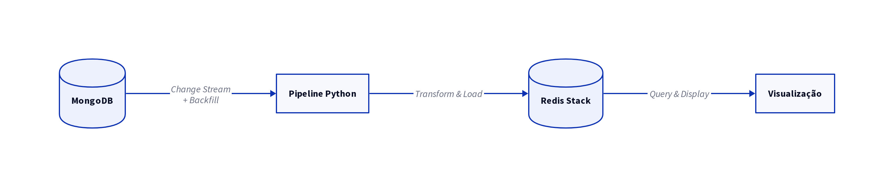

# Trabalho Final — Pipeline MongoDB → Redis


## ⛽ Plataforma Radar Combustível

>Projeto da disciplina **Database In-Memory** do MBA de Engenharia de Dados da FIAP, com foco em modelagem orientada a acesso, pipeline MongoDB → Redis e serving rápido com Redis para consultas analíticas do caso **Radar Combustível**. 

> Prof. Daniel Lemeszenski · Março de 2026


## 👥 Integrantes

> RM361560 - Enio Roberto Lourenço \
> RM360485 - Luis Henrique Kalil Duarte \
> RM363586 - Leila Moreira Gomes Roque \
> RM365533 - Adonias Ferreira Barros


## 🎯 Objetivo

Transformar dados de postos, preços, localização, buscas e avaliações em uma camada de leitura rápida no Redis, capaz de responder perguntas como:

- quais postos têm menor preço por região;
- quais combustíveis estão em alta;
- quais UFs, cidades e bairros têm maior volume de buscas;
- quais postos são mais bem avaliados;
- quais postos tiveram maior variação recente de preço;
- como os preços evoluem ao longo do tempo;
- quais postos estão próximos a um ponto de referência.

## 🧰 Stack Tecnológica

| Camada | Tecnologia | Papel no projeto |
|---|---|---|
| Ingestão e eventos |  | Base principal e origem dos eventos |
| Pipeline |  | Backfill, transformação e sincronização |
| Serving |  | Hash, ZSET, GEO, TimeSeries e RediSearch |
| Visualização |  | Dashboard analítico |
| Infra local |  | Containers do MongoDB e Redis |

## 🧱 Arquitetura Detalhada




```text
┌───────────────────────────── MONGODB ─────────────────────────────┐
│                                                                   │
│  postos                    eventos_preco                          │
│  localizacoes_postos       buscas_usuarios                        │
│  avaliacoes_interacoes                                            │
│                                                                   │
└───────────────────────────────┬───────────────────────────────────┘
                                │
                                │ Change Stream + Backfill
                                ▼
┌──────────────────────── PIPELINE PYTHON ──────────────────────────┐
│                                                                   │
│  init/mongo_seed.py                                               │
│  init/redis_indexes.py                                            │
│  pipeline/event_transformer.py                                    │
│  pipeline/mongodb_consumer.py                                     │
│                                                                   │
│  Ordem do backfill:                                               │
│  1. postos                                                        │
│  2. localizacoes_postos                                           │
│  3. eventos_preco                                                 │
│  4. buscas_usuarios                                               │
│  5. avaliacoes_interacoes                                         │
│                                                                   │
└───────────────────────────────┬───────────────────────────────────┘
                                │
                                ▼
┌────────────────────────── REDIS STACK ────────────────────────────┐
│                                                                   │
│  Hashes                                                           │
│  └─ posto:{posto_id}                                              │
│                                                                   │
│  Sorted Sets                                                      │
│  ├─ ranking:precos:{combustivel}:cidade:{regiao}                  │
│  ├─ ranking:precos:{combustivel}:bairro:{regiao}                  │
│  ├─ ranking:combustiveis:buscas                                   │
│  ├─ ranking:cidades:buscas                                        │
│  ├─ ranking:bairros:buscas                                        │
│  ├─ ranking:postos:avaliacao                                      │
│  └─ ranking:postos:variacao_recente                               │
│                                                                   │
│  GEO                                                              │
│  └─ geo:postos                                                    │
│                                                                   │
│  Time Series                                                      │
│  └─ ts:preco:{posto_id}:{combustivel}                             │
│                                                                   │
│  RediSearch                                                       │
│  └─ idx:postos                                                    │
│                                                                   │
└───────────────────────────────┬───────────────────────────────────┘
                                │
                                ▼
┌──────────────────────── VISUALIZAÇÃO ─────────────────────────────┐
│                                                                   │
│  queries/data-view.py                                             │
│  queries/redis_reader.py                                          │
│                                                                   │
│  Abas do dashboard:                                               │
│  1. Visão Geral                                                   │
│  2. Top Avaliações                                                │
│  3. Ranking de Preço                                              │
│  4. Variação de Preço                                             │
│  5. Séries Temporais                                              │
│  6. Proximidade                                                   │
│                                                                   │
└───────────────────────────────────────────────────────────────────┘
```


## 🗂️ Estrutura do repositório

```text
radar-combustivel-fake-data-generator-main/
├── docker-compose.yml
├── requirements.txt
├── .env.example
├── .env.local
├── README.md
├── docs/
│   └── streaming-mongo-redis.md
├── init/
│   ├── mongo_seed.py
│   └── redis_indexes.py
├── pipeline/
│   ├── event_transformer.py
│   └── mongodb_consumer.py
└── queries/
    ├── data-view.py
    └── redis_reader.py
```

---

## 🧾 Base MongoDB

As 5 coleções obrigatórias do trabalho foram utilizadas:

| Coleção | Função |
|---|---|
| `postos` | cadastro dos postos |
| `localizacoes_postos` | UF, cidade, bairro e geo |
| `eventos_preco` | histórico e atualização de preços |
| `buscas_usuarios` | volume de busca e interesse por combustível |
| `avaliacoes_interacoes` | avaliações e interações |


### MongoDB — Exemplo Coleção `postos`
```json
{
  "_id": {
    "$oid": "69fd43aeeea7eb4f075af9d6"
  },
  "cnpj": "32.181.960/0133-89",
  "nome_fantasia": "Posto da Cruz",
  "bandeira": "Ipiranga",
  "endereco": {
    "logradouro": "Conjunto Sousa",
    "numero": "9196",
    "bairro": "Calafate",
    "cep": "96001338",
    "cidade": "Alves",
    "estado": "RJ"
  },
  "telefone": "0500-083-8637",
  "ativo": true,
  "location": {
    "type": "Point",
    "coordinates": [
      -72.532084,
      -23.046354
    ]
  },
  "created_at": {
    "$date": "2023-09-19T04:36:23.000Z"
  },
  "updated_at": {
    "$date": "2026-05-08T02:00:14.874Z"
  }
}
```


## ⚙️ Estruturas Redis utilizadas

### Hashes
- `posto:{posto_id}` para snapshot resumido do posto

### Sorted Sets
- `ranking:precos:{combustivel}:cidade:{regiao}`
- `ranking:precos:{combustivel}:bairro:{regiao}`
- `ranking:combustiveis:buscas`
- `ranking:cidades:buscas`
- `ranking:bairros:buscas`
- `ranking:postos:avaliacao`
- `ranking:postos:variacao_recente`

### GEO
- `geo:postos`

### Time Series
- `ts:preco:{posto_id}:{combustivel}`

### RediSearch
- `idx:postos`


## 🔧 Configuração do Ambiente

### Pré-requisitos
- Docker + Docker Compose
- Python 3.10+

#### Instalação Opcional 
- [mongo compass](https://www.mongodb.com/try/download/compass) ide para editar dados no mongo
- [redis insight](https://redis.io/insight/) ide para editar dados no redis

### Variáveis de Ambiente

Copie o arquivo de exemplo:

```bash
cp .env.example .env.local
```

```env
MONGO_URI=mongodb://localhost:27017/?directConnection=true
DB_NAME=radar_combustivel
MONGO_DB=radar_combustivel
REDIS_HOST=localhost
REDIS_PORT=6379
REDIS_PASSWORD=
```

## 🚀 Como executar

### 1. Subir a infraestrutura

```bash
docker-compose up -d
```

### 2. Instalar dependências

```bash
pip install -r requirements.txt
```

### 3. Popular o MongoDB

```bash
python init/mongo_seed.py
```

OU para teste rápido, com 1000 registros:

```bash
$env:N=1000; python init/mongo_seed.py
```

### 4. Preparar o Redis

```bash
python init/redis_indexes.py
```

### 5. Iniciar o consumer

```bash
python pipeline/mongodb_consumer.py
```

### 6. Abrir reader textual

```bash
python queries/redis_reader.py
```

### 7. Abrir dashboard

```bash
python -m streamlit run queries/data-view.py
```


## 📊 Dashboard

### Aba 1 — Visão Geral
- KPIs principais
- combustíveis mais buscados
- UFs mais buscadas
- cidades mais buscadas
- bairros mais buscados

### Aba 2 — Top Avaliações
- ranking por **score ponderado**
- combina nota média e número de avaliações
- evita favorecer postos com apenas 1 avaliação

### Aba 3 — Ranking de Preço
- combustível obrigatório
- UF obrigatória
- cidade opcional
- bairro opcional
- preço atual mais recente por posto

### Aba 4 — Variação de Preço
- apenas registros com variação diferente de zero
- tabela com cores por tendência

### Aba 5 — Séries Temporais
- média diária por combustível
- tendência móvel de 7 dias
- histórico detalhado por posto com pelo menos 2 pontos

### Aba 6 — Proximidade
- busca por UF, cidade e bairro
- ou posto de referência
- expansão automática de raio


## 🔍 Exemplos de queries

### Top 10 combustíveis mais buscados
```python
# redis_reader.py
top = redis.zrevrange("ranking:combustiveis:buscas", 0, 9, withscores=True)
```

### Top 10 cidades com maior volume de buscas
```python
top_cities = redis.zrevrange("ranking:cidades:buscas", 0, 9, withscores=True)
```

### Top 10 bairros com maior volume de buscas
```python
top_neighborhoods = redis.zrevrange("ranking:bairros:buscas", 0, 9, withscores=True)
```

### Menor preço por cidade para um combustível
```python
city_keys = list(redis.scan_iter("ranking:precos:gasolina_comum:cidade:*"))
sample_key = city_keys[0]
lowest = redis.zrange(sample_key, 0, 9, withscores=True)
```

### Busca de postos por nome ou filtros com RediSearch
```python
from redis.commands.search.query import Query

results = redis.ft("idx:postos").search(
    Query("@uf:{SP} @cidade:{Almeida}")
    .sort_by("rating_count", asc=False)
    .paging(0, 10)
)
```

### Série temporal de preço de um posto
```python
series_keys = list(redis.scan_iter("ts:preco:*:gasolina_comum"))
sample_ts_key = series_keys[0]
series = redis.execute_command(
    "TS.RANGE",
    sample_ts_key,
    "-",
    "+",
    "AGGREGATION",
    "avg",
    "3600000"
)
```

### Média temporal de um combustível
```python
series = redis.execute_command(
    "TS.MRANGE",
    "-",
    "+",
    "AGGREGATION",
    "avg",
    "3600000",
    "FILTER",
    "metric=price",
    "combustivel=GASOLINA_COMUM"
)
```

### Rodando direto no redis-cli
```bash
# Abrir redis-cli no container
docker exec -it radar-combustivel-redis redis-cli

# Top 10 combustíveis mais buscados
ZREVRANGE ranking:combustiveis:buscas 0 9 WITHSCORES

# Top 10 cidades com maior volume de buscas
ZREVRANGE ranking:cidades:buscas 0 9 WITHSCORES

# Top 10 bairros com maior volume de buscas
ZREVRANGE ranking:bairros:buscas 0 9 WITHSCORES

# Descobrir uma chave de ranking por cidade
SCAN 0 MATCH ranking:precos:gasolina_comum:cidade:* COUNT 20

# Menor preço usando uma chave
ZRANGE ranking:precos:gasolina_comum:cidade:<regiao_valida> 0 9 WITHSCORES

# Busca textual no índice RediSearch
FT.SEARCH idx:postos "@uf:{SP} @cidade:{Almeida}" SORTBY rating_count DESC LIMIT 0 10

# Descobrir uma série temporal
SCAN 0 MATCH ts:preco:*:gasolina_comum COUNT 20

# Série temporal de preço por hora
TS.RANGE ts:preco:<posto_id_valido>:gasolina_comum - + AGGREGATION avg 3600000

# Média temporal do combustível
TS.MRANGE - + AGGREGATION avg 3600000 FILTER metric=price combustivel=GASOLINA_COMUM
```

## 📋 Checklist de Validação

Ao terminar o projeto, verifique:

- [ ] `docker-compose up -d` sobe sem erros
- [ ] `mongo_seed.py` popula as 5 coleções
- [ ] `redis_indexes.py` cria `idx:postos` sem erro
- [ ] `mongodb_consumer.py` processa backfill sem travar
- [ ] `ZREVRANGE ranking:combustiveis:buscas 0 9` retorna resultados
- [ ] `ZRANGE ranking:precos:... 0 9` retorna ranking de preço por região
- [ ] `GEOSEARCH geo:postos ...` retorna postos próximos
- [ ] `TS.RANGE` retorna histórico para posto com série
- [ ] `TS.MRANGE` retorna evolução agregada por combustível
- [ ] o dashboard abre todas as 6 abas corretamente
- [ ] o ranking de avaliações usa score ponderado

## 💡 Decisões de Arquitetura

| Decisão | Escolha | Justificativa |
|---|---|---|
| Fonte de eventos | MongoDB Change Stream | Captura novos inserts sem polling manual |
| Backfill | Ordem controlada por coleção | Garante integridade dos hashes antes dos agregados |
| Snapshot dos postos | Hashes | Acesso O(1) aos atributos principais |
| Rankings | Sorted Sets | `ZADD`, `ZINCRBY`, `ZRANGE` e `ZREVRANGE` com ordenação nativa |
| Busca territorial | GEO | `GEOSEARCH` resolve proximidade de forma nativa |
| Histórico temporal | RedisTimeSeries | Série temporal com agregações nativas |
| Busca textual | RediSearch | Índice útil para filtros e demonstração de consulta rápida |
| Consistência | Eventual | Adequada para métricas, rankings e painéis analíticos |
| Avaliações | Score ponderado | Evita distorção por postos com pouquíssimas avaliações |

## 🔗 Referências

- [MongoDB Change Streams Docs](https://www.mongodb.com/docs/manual/changeStreams/)
- [Redis Sorted Sets](https://redis.io/docs/data-types/sorted-sets/)
- [RediSearch Query Syntax](https://redis.io/docs/interact/search-and-query/)
- [RedisTimeSeries](https://redis.io/docs/data-types/timeseries/)
- Repositório do lab Vector DB: `commithouse/lab-vector-db-redis`


## 🧹 Comandos para Limpar o Ambiente

```bash
# Encerrar containers e remover volumes
docker-compose down -v

# (Opcional) remover imagens baixadas
docker-compose down --rmi local
```
